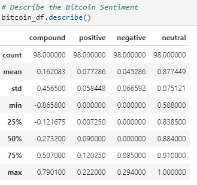
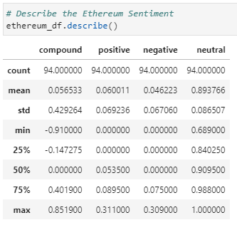

# NLP-Homework

Using Sentiment Analysis, we found the following information about Bitcoin and Ethereum:

> Which coin had the highest mean positive score?

    Bitcoin has a higher score of 0.77

> Which coin had the highest negative score?

    Ethereum has a higher compound score of 0.85

> Which coin had the highest positive score?

    Ethereum has a higher positive score of 0.31